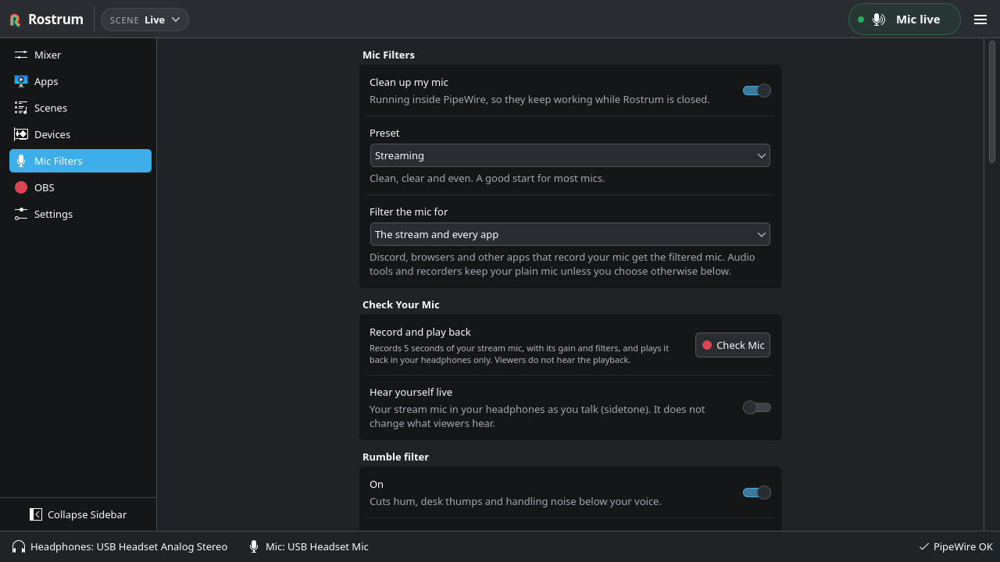

<h1 align="center">
  <picture>
    <source media="(prefers-color-scheme: dark)" srcset="docs/brand/lockup-on-dark.svg">
    
  </picture>
</h1>

<p align="center">
  <a href="https://github.com/rostrum-audio/rostrum/actions/workflows/ci.yml"></a>
  <a href="LICENSE"></a>
  
  
  
  <a href="https://getrostrum.dev"></a>
</p>

> *A stream mix console for Linux, not a patchbay.*


## 🌟 Highlights

- 🎚️ **Buses, not wires.** Game, Voice, Mic, Music, Alerts and Desktop each get a fader and mute,
  and every playback bus gets solo.
- 🎧 **Two mixes from one console.** Send each bus to your headphones, to the stream, or to both.
  Music can play for viewers without playing in your ears.
- 🔴 **OBS in one click.** OBS captures `Rostrum Stream Mix` and `Rostrum Mic` separately.
  Preview the setup changes, including muting duplicate captures, and undo applied changes.
  Other application or headphone captures can bypass Rostrum’s bus exclusions.
- 🎙️ **Local microphone filters.** Optional RNNoise reduces background noise, with a rumble
  filter, gate, EQ, compressor and limiter. Apply them to the stream and eligible recording apps,
  or only the stream; audio tools stay plain by default and per-app choices are available.
  Processing runs inside PipeWire, including after Rostrum quits.
- 👂 **Check your stream mic.** Check Mic records 5 seconds of your Rostrum Mic signal, gain and
  filters included, plays it back in your headphones only, and tells you if the level is good, too
  quiet or too loud. This checks the mic path before OBS, not the audience’s final audio.
- ✅ **Check stream readiness.** Inspect effective controls, devices, channel links and OBS
  capture observations without changing settings or playing/recording sound. Incomplete or
  stale evidence stays Not verified; intentional exclusions and idle apps are normal.
- 🎬 **Scenes.** Recall every level, mute and destination at once, from the header or a global shortcut.
- 🪄 **Apps find their bus on their own.** Discord goes to Voice, Spotify to Music, Steam and Proton
  games to Game, and Streamer.bot to Alerts. Every placement shows why it was made, and OBS and audio
  tools are never touched.
- 🧲 **Apps remember their bus.** Save an app’s bus with “Always” and it lands there again,
  including before Rostrum starts at your next login.
- 🎛️ **Control from anywhere.** Global hotkeys (push to talk, panic mute, scene switching), the
  tray, and the `rostrum` command or D-Bus for Stream Deck buttons and scripts. Optional
  auto-ducking turns Music down while you speak.
- 🛟 **Safe by design.** The virtual devices live in PipeWire, so audio keeps flowing if Rostrum
  quits or crashes.
- 🔒 **Private crash reports, your call.** In official builds, Rostrum asks after a crash before
  sending anything to Sentry. A report holds only the crash location and software versions: no
  names, paths, device names or IDs. You can read the exact report first. See
  [docs/privacy.md](docs/privacy.md).
- ⬆️ **Optional updates.** When enabled, a daily check contacts getrostrum.dev and GitHub.
  AppImages can automatically download and replace themselves after checking the release checksum,
  or wait for Install; checking and automatic installation have separate settings. Source installs are rebuilt manually;
  package-managed installs use their package manager. A real public-version upgrade is not yet tested.


## ℹ️ Overview

Rostrum splits your game, voice chat, mic, music, alerts and desktop audio into named buses. Each
bus goes to your headphones, to the stream, or to both. OBS captures Stream Mix and Rostrum Mic
separately. Tools like qpwgraph and Helvum show every port and every link. Rostrum hides the graph and gives you a mixing
desk instead: faders, meters, mute and solo, and scenes you can switch live.

**Released:** [Rostrum 0.1.0](https://github.com/rostrum-audio/rostrum/releases/tag/v0.1.0),
with an [x86_64 AppImage](https://github.com/rostrum-audio/rostrum/releases/download/v0.1.0/Rostrum-0.1.0-x86_64.AppImage).
The AppImage was functionally validated in clean Ubuntu 26.04 x86_64 with glibc 2.43,
PipeWire 1.6.2 and WirePlumber 0.5.13. Its glibc 2.43 binary floor is not a guarantee
that every newer Linux distribution works. Other desktop/hardware combinations need
their own checks; source-build CI on Fedora and Arch does not validate this AppImage there.

### ✍️ Authors

Rostrum is made by [Rostrum Audio](https://github.com/rostrum-audio). More at
[getrostrum.dev](https://getrostrum.dev).


## 🚀 Usage

Five minutes to a split stream:

1. **Start Rostrum** with the AppImage ([download and launch](#appimage-010-x86_64)),
   from the app menu after a source install, or run `./build/src/app/rostrum`. Fully quit any
   existing instance first; closing its window may leave it in the tray.
2. **Run first-time setup.** Follow the short steps, with a summary at the end:
   - **Headphones:** press Test and a short chime plays only there.
   - **Mic:** speak and watch its meter.
   - **Apps and Buses:** whether apps go to their bus automatically, and which kind of app each bus receives.
   - **Startup:** launch at login (recommended) and start hidden in the tray.
   - **Privacy and Updates:** crash reports (send, ask, or never; official builds only) and update
     checks.
   - **OBS:** if OBS is installed, **Set Up OBS** shows the same preview as the OBS page (Rostrum
     creates its devices first), or **Skip**. Also whether Rostrum follows OBS while it runs.
   - **Ready:** each choice in one list. Click one to change it, then press **Create Mix**.

   Skip Setup creates the same mix with the defaults. Everything can be changed later in Settings.
   Settings groups the existing controls into General, Audio, Hotkeys, Integrations, and Application tabs.
   **General → Startup → Launch at login** writes an autostart desktop file with an absolute
   `Exec`: the quoted AppImage path or the full path to `~/.local/bin/rostrum`, followed by
   `--autostart`. It does not rely on `rostrum` being on the login session's `PATH`.

   

3. **Put apps on buses.** Start Discord, your game and Spotify. Rostrum recognises most apps and
   puts them on the matching bus by itself; the Apps page marks those **Auto** and says why ("Steam
   game", "Recognised as a voice chat app"). To change one, drag its chip onto another bus on the
   Mixer, or open Apps and press Move. Leave "Always" on and the app goes straight to that bus
   whenever Rostrum sees it, and from your next login on even before Rostrum starts. Take an app off
   its bus and Rostrum stops placing it. Right-click a strip → **Receives Automatically** to choose
   which kind of app each bus gets. Apps that report no name (Wine and Proton games) get a banner so
   you can name them once. Each app on the Apps page also has its own volume and Mute, without
   touching the rest of its bus; with "Always" on, they save with the scene.

   

4. **Pick destinations.** Each bus goes to Headphones, Stream or Both. Defaults: Music → Stream (excluded from headphones), the other playback buses → Both, Mic → Stream with sidetone off.
   Headphones Only removes the bus’s Stream Mix sends; Stream Only removes its headphone sends.
   This controls Rostrum’s outputs, not independent OBS application/headphone captures.
   The small slider under each playback bus sets its balance. If you listen on one ear, turn on
   Devices → Mono headphones.
5. **Add Rostrum to OBS.** Open the OBS page and press **Set Up OBS**. A preview lists every
   change: your mic source switches to **Rostrum Mic**, a **Rostrum Stream Mix** source joins
   every scene, and sources that would double audio (desktop audio, single-app captures) are
   muted, never deleted. With OBS running this goes through obs-websocket (included in
   OBS 28+; enable its server in OBS if needed; Rostrum reads the local port/password settings). With OBS closed, Rostrum edits the
   scene collection after backing it up. **Undo OBS Changes** puts everything back. The page also
   shows observed OBS capture targets from the PipeWire graph. "Set it up by hand" has the manual steps.

   For manual setup, add **Audio Output Capture** (or the PipeWire audio capture plugin)
   for **Rostrum Stream Mix** (`rostrum.stream.monitor` with PulseAudio capture). Set
   **Mic/Aux** or one **Audio Input Capture** to **Rostrum Mic** (`rostrum.mic`). Use one
   capture per output, not both a global and scene source for the same device. Disable
   or mute other desktop, headphone/default-monitor, raw-mic and application captures:
   they can double audio or bypass Headphones Only exclusions. A single Rostrum bus
   such as Desktop is not the Stream Mix. Check OBS track assignments and make a short recording.

   **Check stream readiness** inspects controls, devices, channel routing and OBS capture
   observations. Results are Verified, Needs attention, Intentionally excluded/idle or
   Not verified. It does not change settings or play/record audio, and it cannot guarantee
   recorded tracks or audience sound. See [the check’s scope](docs/stream-readiness.md).

   

   *Readiness separates verified controls and routing from OBS capture that has not been verified.*

   **While you stream**, Rostrum follows OBS quietly over the same localhost connection, whenever
   OBS is open (Settings → Integrations → OBS → "Follow OBS while it runs"). The header shows a red **LIVE** badge
   and a **REC** badge with the elapsed time, and the tray tooltip says the same. If a stream
   starts with your mic muted, nothing reaching the stream mix, or OBS not recording Rostrum, a
   banner and a desktop notification say so. Under "When OBS switches scenes" on the OBS page,
   pick a Rostrum scene for each OBS scene. When OBS puts that scene on program, Rostrum loads it
   at once, without asking, after saving the current scene if auto-save is on.

6. **Make more scenes.** Scenes recall every level, mute and destination, and changes save to the
   live scene by themselves. On the Scenes page, **New** starts an empty scene or one from a preset
   (Gaming, Just Chatting, Music Stream, Podcast, Be Right Back) that keeps your buses and app
   rules. Switch with Meta+Alt+PgDown or the scene menu in the header. Move Up and Move Down set
   the order that the header, the tray and the scene hotkeys follow; the badge shows each scene's
   hotkey number.
7. **Clean up your mic (optional).** Open Mic Filters and turn on "Clean up my mic", or press FX
   on the mic strip. Pick a preset (Light, Streaming, Noisy room, Broadcast) and adjust each
   filter if you like. "Filter the mic for" chooses between the stream and every app, or only the
   stream; the Apps list below it switches single apps, and remembers apps that are not running.
   Discord and browsers get the filtered mic, audio tools such as Audacity keep the plain one. Your
   mic and the system's default input are never changed: apps are moved to "Rostrum Filtered Mic",
   which you can also pick in an app's own settings. OBS keeps recording Rostrum Mic, which is
   filtered too.

   

8. **Check how you sound.** Under "Check Your Mic" (on Mic Filters and Devices, or Check Mic in
   the header's mic popup), press **Check Mic** and talk for 5 seconds. Rostrum plays the
   recording back in your headphones only, with Rostrum’s mic gain and filters,
   and says whether the level is good, too quiet or too loud. It does not test OBS or audience audio. "Hear yourself live" turns on
   sidetone, so you hear your mic as you talk.

If an app sits on a bus but its meter stays still and Mute does nothing, another program has moved
its audio somewhere else, usually Easy Effects with "Process all output streams" on. The app's chip
gets a warning outline and the Apps page says where it really plays; **Move Back** puts it on its
bus. Rostrum takes back such moves by itself in the first seconds after an app starts. To keep
Easy Effects on what you hear, choose Easy Effects Sink as Headphones on the Devices page: the
whole headphone mix then goes through it.

### Include in Twitch VOD

Track 1 is the live mix. Track 2 is the saved Twitch VOD.

`VOD` is reserved for the VOD master; a bus cannot be named VOD.

Each playback bus has an **Include in Twitch VOD** checkbox. Music is off the VOD mix by default. Game, Voice, Alerts, and Desktop are on. The mic has no checkbox; Rostrum Mic is on tracks 1 and 2.

A Headphones-only bus is in neither mix. Switching it back to Stream or Both keeps the checkbox as it was.

| Bus destination | Include in Twitch VOD | Audio destinations |
| --- | --- | --- |
| Stream or Both | On | Live stream and saved VOD |
| Stream or Both | Off | Live stream only |
| Headphones | Either | Neither mix |

**Set Up OBS** adds a named Audio Output Capture, "Rostrum VOD Mix", on track 2. It does not use Desktop Audio 2. The Set Up OBS preview lists:
- **Rostrum Mic** on tracks 1 and 2
- **Rostrum Stream Mix** on track 1
- **Rostrum VOD Mix** on track 2

Check these settings in OBS:
- **Settings → Stream:** Service is Twitch.
- **Settings → Output:** Twitch VOD Track is 2. This setting appears only when the service is Twitch and Enable Custom Encoder Settings is on. Enhanced Broadcasting ignores this track.
- **Advanced Audio Properties:** Rostrum Mic has tracks 1 and 2 checked. Rostrum Stream Mix has track 1 checked. Rostrum VOD Mix has track 2 checked. Desktop Audio is off both tracks.

Stream readiness stays Needs attention until track 2 is selected and Rostrum VOD Mix is captured.

Watch out for leaks. Desktop Audio on track 2 puts Music back into the VOD. Leave Desktop Audio disabled or muted.

A local OBS recording uses its own track boxes. Track 2 in a recording is the VOD mix only if the recording is set to track 2.

How to check: run a short Twitch stream with music playing. The live replay has the music; the saved VOD does not.

### ⌨️ Shortcuts

Default global shortcuts, rebindable in Settings or in System Settings → Keyboard → Shortcuts on Plasma:

| Action | Shortcut |
| --- | --- |
| Mute mic | Meta+Alt+M |
| Mute all playback to stream | Meta+Alt+S |
| Previous / next scene | Meta+Alt+PgUp / Meta+Alt+PgDown |
| Load scene 1–4 (in Scenes page order) | Meta+Alt+1 … Meta+Alt+4 |

More actions are there to bind in Settings → Hotkeys, with no shortcut by default: push to talk
and push to mute (act while the keys are held), panic mute (mic and stream at once; press again to
bring both back), sidetone on or off, mute headphones, Stream volume up and down (5 %), mic
filters on or off, check mic, load scene 5–8, and a mute for each playback bus. Push to talk, push to mute and panic are never saved.
When the Rostrum window is not in front, a hotkey that mutes, unmutes or switches scenes shows a
short on-screen message (Settings → General → "Show hotkey changes on screen").

The tray menu has Show or Hide Rostrum, Mute Mic, Mute Stream, Previous and Next Scene, a Scenes submenu, Restart Rostrum
(handy after installing a new build) and Quit.
Middle-click the tray icon to mute or unmute the mic, scroll on it to change the Stream master.

With a fader focused: Up/Down 1 %, Page Up/Down 10 %, M mute, S solo, 1/2/3 Headphones/Stream/Both.
Double-click a fader, a balance slider or the mic gain to reset it.
App menu → Compact View shrinks Rostrum to a small mixer (mic, scene, masters and a slim fader per
bus) that can stay on top of a game or OBS; it remembers its own size and comes back that way.
Ctrl+Z and Ctrl+Shift+Z undo and redo level and bus edits in the live scene (not solo, and never
the mic mute). Deleted scenes stay in Scenes → Recently Deleted for 30 days.
F6 moves focus between the header, the sidebar and the page.

### 🎛️ Command line and D-Bus

The `rostrum` command drives the running instance, for Stream Deck buttons, KDE Connect commands
or scripts. Without a running instance, the list options read the saved scenes and the other
options start Rostrum first.

```sh
rostrum --toggle-mic                 # also --mute-mic, --unmute-mic
rostrum --scene "Just Chatting"
rostrum --action panic_mute          # any id from --list-actions
rostrum --action toggle_mic_filters
rostrum --set-volume game=0.8        # or game=80%; stream and phones are the masters
rostrum --list-scenes                # also --list-actions, --list-buses
```

Exit status: 0 done, 1 refused (unknown scene, bus or action, bad level), 2 Rostrum could not be
reached. The same controls are on the session bus as `dev.getrostrum.Rostrum1` at
`/dev/getrostrum/Rostrum/Control`, described in
[data/dev.getrostrum.Rostrum1.xml](data/dev.getrostrum.Rostrum1.xml). There is no network
listener.

### OpenDeck

Install [OpenDeck](https://opendeck.nekename.me/) and open it once. In Rostrum, go to
Settings → Integrations → OpenDeck → Install. Rostrum extracts its bundled plugin, detects native and
Flatpak configuration folders, and asks which to use if both exist. Choose plugins folder… is
available for a custom location; it stays selected until cleared. Update and Repair replace only
Rostrum's plugin, preserving your OpenDeck profiles and other plugins. Python 3 is required.
Restart OpenDeck, then drag Toggle mic, Panic mute, Switch scene, or Toggle bus mute onto a key.
Choose a scene or bus in the property inspector and keep Rostrum running. The plugin uses
session D-Bus (`gdbus`) first, with `rostrum --no-start` as a fallback; it never opens the deck or
starts Rostrum. Older Rostrum versions without `--no-start` cannot use the CLI fallback.

Manual copy fallback: copy `tools/opendeck/dev.getrostrum.Rostrum.sdPlugin` into the plugins
folder shown by OpenDeck settings: **Open config directory**, then `plugins`. Flatpak OpenDeck
uses its own config directory. Restart OpenDeck and drag one of the four actions onto a key.

Test without hardware: `python3 -B tools/opendeck/test_plugin.py`.
Manual check: with OpenDeck and Rostrum running, press a Toggle mic key and confirm that the
mixer's Mic strip matches its Mic live / Mic muted title.

### ⚙️ Defaults

- Default scene name: `Live`.
- Six buses: Mic, Game, Voice, Music, Alerts, Desktop (at most 12).
- Music bus destination: Stream. Other playback buses: Both. Mic: Stream, sidetone off.
  Every bus balance is centred. Mono headphones: off.
- Assign apps automatically: on. Game, Voice, Music, Alerts and Desktop each receive their own kind
  of app; Desktop gets everything else that is recognised. The Mic bus receives nothing.
- Solo is not saved in the scene.
- Scene fade: off (scenes switch at once). Auto-ducking: off; when on, your mic turns Music down by
  12 dB while you speak. Neither is saved in scenes.
- Mic filters: off. When on: the Streaming preset, for the stream and every app except audio tools.
  A setting, not part of a scene.
- If your saved mic is unplugged, the stream mic stays silent until it comes back. No other mic
  goes live unless you turn on "Use another mic while mine is unplugged" on the Devices page.
- Closing the window hides it to the tray (when the desktop has one); minimizing just minimizes.
  Both are switches in Settings → General. Quit from the tray or Settings.
- Scroll-to-adjust faders: on. Confirm scene switch: off. Launch at login: off until you turn it
  on (setup recommends it).
- Crash reports: ask after a crash. Update checks: once a day. Automatic install: on, for the
  AppImage only.
- Follow OBS while it runs: on (localhost only, read-only). Go-live warnings: on. No OBS scenes
  mapped.

### 🗂️ Where things live

- Settings and scenes: `~/.config/rostrum/` (TOML). Log: `~/.local/state/rostrum/rostrum.log`.
- Deleted scenes: `~/.config/rostrum/trash/`, kept 30 days. The setup from before a restore:
  `~/.config/rostrum/backups/`. Settings → Application → Advanced → Back Up Settings… writes settings, hotkeys,
  devices and scenes to one file, without crash report and update choices, window state or when
  apps were last seen.
- Crash reports waiting to be sent or discarded: `~/.local/state/rostrum/crashes/` (at most 10,
  none older than 30 days), and sentry-native's own database in `~/.local/state/rostrum/sentry/`.
- App rules for the next login: `~/.config/pipewire/pipewire-pulse.conf.d/50-rostrum.conf` and
  `~/.config/pipewire/client.conf.d/50-rostrum.conf`. Nothing is written to `~/.config/wireplumber/`.
- Autostart, when on: `~/.config/autostart/dev.getrostrum.Rostrum.desktop`.

Rostrum's virtual devices live in PipeWire, not in the app, so audio keeps flowing if Rostrum quits
or crashes. To remove Rostrum completely, quit it, delete the files above, and run
`systemctl --user restart pipewire pipewire-pulse wireplumber` to drop its devices.


## ⬇️ Installation

### AppImage 0.1.0 (x86_64)

Download [Rostrum-0.1.0-x86_64.AppImage](https://github.com/rostrum-audio/rostrum/releases/download/v0.1.0/Rostrum-0.1.0-x86_64.AppImage)
and [SHA256SUMS](https://github.com/rostrum-audio/rostrum/releases/download/v0.1.0/SHA256SUMS)
into the same folder. [Release notes and compatibility limits](https://github.com/rostrum-audio/rostrum/releases/tag/v0.1.0).

```sh
sha256sum -c SHA256SUMS
chmod +x Rostrum-0.1.0-x86_64.AppImage
./Rostrum-0.1.0-x86_64.AppImage
# If FUSE is unavailable:
./Rostrum-0.1.0-x86_64.AppImage --appimage-extract-and-run
```

Fully quit an existing instance through tray/menu **Quit** before launching another build.
The AppImage and source installation share settings, scenes and routing rules; a second launch
can activate the old process. Changing XDG paths alone does not isolate audio.

The validated AppImage environment is **Ubuntu 26.04 x86_64, glibc 2.43, PipeWire 1.6.2,
WirePlumber 0.5.13**. Older glibc and aarch64 are unsupported by this artifact. Qt/KDE/QML
and icons are bundled; host development packages are not required. A working audio session,
desktop D-Bus, X11 or Wayland, graphics/font libraries and FUSE (for mounted launch) are required.
The clean runtime’s host packages and [dependency/source/replacement instructions](docs/appimage-dependencies.md)
are documented in [releasing.md](docs/releasing.md#what-gets-published).

### Build from source

These dependency lists are for building Rostrum, not for running the AppImage. Source-level
requirements are Qt 6.5+, KDE Frameworks 6.8+, PipeWire 1.0+ and WirePlumber 0.5+;
mic filters additionally require PipeWire 1.4+ audio-convert support. Meeting these
minimum versions does not establish AppImage compatibility.

### 🟠 Kubuntu / Ubuntu

Ubuntu 26.04 or newer (24.04 has Qt 6.4 and no KDE Frameworks 6):

```sh
sudo apt install build-essential cmake ninja-build pkg-config extra-cmake-modules \
  libpipewire-0.3-dev libtomlplusplus-dev qt6-base-dev qt6-declarative-dev qt6-websockets-dev \
  libkirigami-dev kirigami-addons-dev libkf6coreaddons-dev libkf6dbusaddons-dev \
  libkf6i18n-dev libkf6globalaccel-dev libkf6statusnotifieritem-dev \
  qml6-module-org-kde-kirigami qml6-module-org-kde-kquickcontrols qml6-module-org-kde-desktop \
  qml6-module-org-kde-kirigamiaddons-formcard qml6-module-org-kde-kitemmodels \
  qml6-module-qtquick-dialogs qml6-module-qtcore qt6-svg-plugins \
  pipewire pipewire-pulse wireplumber
```

### 🎩 Fedora

Fedora 43 or newer (checked on Fedora 44):

```sh
sudo dnf install gcc-c++ cmake ninja-build pkgconf-pkg-config extra-cmake-modules \
  pipewire-devel tomlplusplus-devel qt6-qtbase-devel qt6-qtdeclarative-devel qt6-qtwebsockets-devel \
  kf6-kirigami-devel kf6-kcoreaddons-devel kf6-kdbusaddons-devel kf6-ki18n-devel \
  kf6-kglobalaccel-devel kf6-kstatusnotifieritem-devel \
  kf6-kirigami-addons kf6-kdeclarative kf6-qqc2-desktop-style kf6-kitemmodels qt6-qtsvg \
  pipewire pipewire-pulseaudio wireplumber
```

### 🔷 Arch Linux

Arch is a rolling release; these packages were last checked on 3 October 2026 (Qt 6.11, KDE
Frameworks 6.30):

```sh
sudo pacman -S --needed base-devel cmake ninja extra-cmake-modules tomlplusplus \
  qt6-base qt6-declarative qt6-websockets qt6-svg \
  kirigami kirigami-addons kcoreaddons kdbusaddons ki18n kglobalaccel kstatusnotifieritem \
  kdeclarative qqc2-desktop-style kitemmodels \
  pipewire pipewire-pulse wireplumber
```

### 🔨 Build and install

From a clone of this repository (`git clone https://github.com/rostrum-audio/rostrum && cd rostrum`):

```sh
cmake -S . -B build -G Ninja
cmake --build build
cmake --install build --prefix ~/.local
```

Installing into `~/.local` adds the app menu entry, the icon and the System Settings shortcut page.

### 📋 Source-build requirements

- Linux with PipeWire 1.0 or newer and WirePlumber 0.5 or newer. PulseAudio is not used or required.
  Mic filters need PipeWire 1.4 or newer; on older versions the Mic Filters page says so and
  everything else works.
- Qt 6.5+ (Base, Declarative, WebSockets and SVG), KDE Frameworks 6.8+ (Kirigami, CoreAddons,
  DBusAddons, GlobalAccel, I18n, StatusNotifierItem, and at run time KDeclarative, KItemModels and
  QQC2 Desktop Style), Kirigami Addons, toml++ 3, CMake 3.22+ and C and C++20 compilers.
- Noise removal uses RNNoise. With your distro's rnnoise development package installed it links
  that; otherwise CMake downloads the pinned RNNoise 0.2 release at configure time and compiles it
  in. `-DROSTRUM_RNNOISE=system`, `bundled` or `off` choose explicitly (`off` builds the mic
  filters without noise removal).

For source builds on another distro, install the same components under its own package names. CI builds the app on
Ubuntu, Fedora and Arch with the lists above, runs the tests and starts it once to catch missing
QML modules.

Smoke-tested on **Kubuntu 26.04 LTS, KDE Plasma 6 on Wayland**, PipeWire 1.6.2, WirePlumber 0.5.13,
Qt 6.10, KDE Frameworks 6.24.


## 💭 Feedback and Contributing

- 🐛 Found a bug or want a feature? [Open an issue](https://github.com/rostrum-audio/rostrum/issues).
- ✉️ Questions and feedback: hello@getrostrum.dev
- 🔒 Security problems: security@getrostrum.dev. See [SECURITY.md](SECURITY.md).

Contributions are welcome: start with [CONTRIBUTING.md](CONTRIBUTING.md), and please follow the
[Code of Conduct](CODE_OF_CONDUCT.md). Run `ctest --test-dir build` before sending a change.
Headset, OBS and reboot checks stay manual: walk through [docs/manual-tests.md](docs/manual-tests.md)
for anything that touches audio routing. Rostrum ships in English only so far; to add a language,
see [Translating](CONTRIBUTING.md#translating).

### 🛠️ Development

```sh
cmake -S . -B build -G Ninja
cmake --build build
ctest --test-dir build
./build/src/app/rostrum
```

Configure with `-DROSTRUM_BUILD_APP=OFF` to build only the engine, tools and tests.
Logs go to `~/.local/state/rostrum/rostrum.log`; a crash appends a backtrace there. Official
builds use `cmake --preset official`, which turns on crash reports to Rostrum's Sentry project and
fetches a pinned sentry-native release at configure time; other builds have no crash reporting.
`-DROSTRUM_UPDATE_URL=…` points updates at your own feed. See [docs/privacy.md](docs/privacy.md)
for both, and for testing against a local server.


## 📖 Further reading

- [How the audio side works, and why](docs/audio.md)
- [Crash reports and updates: what is sent, and when](docs/privacy.md)
- [Manual test plan](docs/manual-tests.md)
- [Isolated audio safety integration tests](tests/integration/README.md)
- [Releasing](docs/releasing.md)
- [Security policy](SECURITY.md)
- [Contributing](CONTRIBUTING.md) and [Code of Conduct](CODE_OF_CONDUCT.md)
- [Accessibility](ACCESSIBILITY.md)
- [getrostrum.dev](https://getrostrum.dev)


## 📄 License

Apache-2.0. See [LICENSE](LICENSE).

The mic filter plugin can include [RNNoise](https://github.com/xiph/rnnoise) (BSD-3-Clause); such
builds install its licence as `share/licenses/rostrum/RNNoise-COPYING`.
