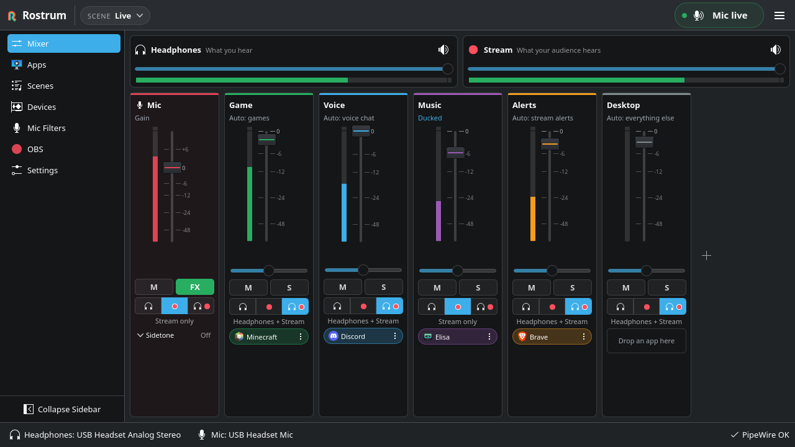
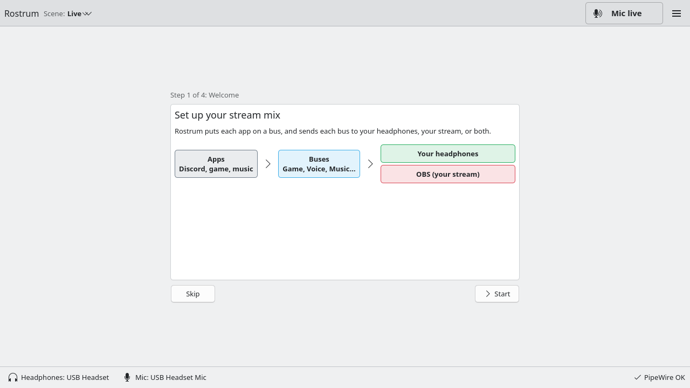
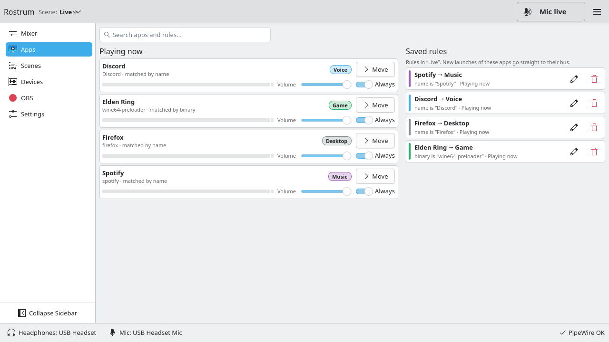
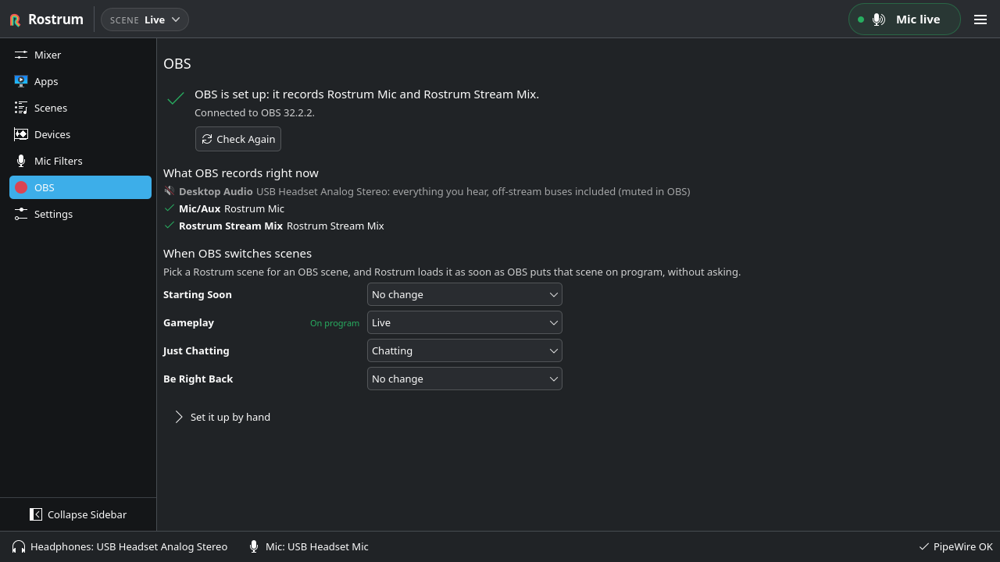

# Rostrum

A stream mix console for Linux, not a patchbay.

Rostrum splits your game, voice chat, mic, music, alerts and desktop audio into named buses,
sends each bus to your headphones, to the stream, or to both, and gives OBS one clean
`Rostrum Stream Mix` and one `Rostrum Mic` to capture. Scenes recall the whole mix with one click.

Status: v1 is feature-complete and smoke-tested on Kubuntu. The headset, OBS and reboot checks in
[docs/manual-tests.md](docs/manual-tests.md) still need a person with the hardware. The repo is
private for now and is written so it can be made public later.



Rostrum targets any current Linux desktop on PipeWire and WirePlumber. Kubuntu is the development
machine, not the only supported system. Plasma, GNOME, and other desktops are in scope. X11 is a fallback.

## Five minutes to a split stream

1. **Start Rostrum** from the app menu (after `cmake --install`, see Build) or run
   `./build/src/app/rostrum`.
2. **Run the wizard.** Welcome → Headphones (press Test: a short chime plays only there) → Mic (speak
   and watch its meter) → Buses → **Create Mix**. Skip creates the same mix with the defaults.

   

3. **Put apps on buses.** Start Discord, your game and Spotify. On the Mixer, drag each app chip
   onto its bus, or open Apps and press Move. Leave "Always" on and the app goes straight to that
   bus whenever Rostrum sees it, and from your next login on even before Rostrum starts. Apps that report no name (Wine and Proton games) get
   a banner so you can name them once.

   

4. **Pick destinations.** Each bus goes to Phones, Stream or Both. Defaults: Music → Stream (your
   viewers hear it, you don't), the other playback buses → Both, Mic → Stream with sidetone off.
5. **Add Rostrum to OBS.** Open the OBS page and press **Set Up OBS**. A preview lists every
   change: your mic source switches to **Rostrum Mic**, a **Rostrum Stream Mix** source joins
   every scene, and sources that would double audio (desktop audio, single-app captures) are
   muted, never deleted. With OBS running this goes through obs-websocket (on by default since
   OBS 28; Rostrum reads its password from OBS's own settings). With OBS closed, Rostrum edits the
   scene collection after backing it up. **Undo OBS Changes** puts everything back. The page also
   shows what OBS really records, from the PipeWire graph. "Set it up by hand" has the manual steps.

   

6. **Save the scene** (Ctrl+S or the scene menu in the header). Scenes recall every level, mute and
   destination. Make a second one for "Just Chatting" and switch with Meta+Alt+PgDown.

Default global shortcuts, rebindable in Settings or in System Settings → Shortcuts on Plasma:

| Action | Shortcut |
| --- | --- |
| Mute mic | Meta+Alt+M |
| Mute all playback to stream | Meta+Alt+S |
| Previous / next scene | Meta+Alt+PgUp / Meta+Alt+PgDown |
| Load scene 1–4 | Meta+Alt+1 … Meta+Alt+4 |

With a fader focused: Up/Down 1 %, Page Up/Down 10 %, M mute, S solo, 1/2/3 Phones/Stream/Both.
F6 moves focus between the header, the sidebar and the page.

## Defaults

- License: Apache-2.0.
- Default scene name: `Live`.
- Six buses: Mic, Game, Voice, Music, Alerts, Desktop (at most 12).
- Music bus destination: Stream. Other playback buses: Both. Mic: Stream, sidetone off.
- Solo is not saved in the scene.
- Close window hides to tray (when the desktop has one). Quit from the tray or Settings.
- Scroll-to-adjust faders: on. Confirm scene switch: off. Launch at login: off.

## Where things live

- Settings and scenes: `~/.config/rostrum/` (TOML). Log: `~/.local/state/rostrum/rostrum.log`.
- App rules for the next login: `~/.config/pipewire/pipewire-pulse.conf.d/50-rostrum.conf` and
  `~/.config/pipewire/client.conf.d/50-rostrum.conf`. Nothing is written to `~/.config/wireplumber/`.
- Autostart, when on: `~/.config/autostart/dev.getrostrum.Rostrum.desktop`.

Rostrum's virtual devices live in PipeWire, not in the app, so audio keeps flowing if Rostrum quits
or crashes. To remove Rostrum completely, quit it, delete the files above, and run
`systemctl --user restart pipewire pipewire-pulse wireplumber` to drop its devices.

How the audio side works, and why: [docs/audio.md](docs/audio.md).

## Development machine

Smoke-tested on **Kubuntu 26.04 LTS, KDE Plasma 6 on Wayland**, PipeWire 1.6.2, WirePlumber 0.5.13,
Qt 6.10, KDE Frameworks 6.24.

## Requirements

- PipeWire 1.0 or newer and WirePlumber 0.5 or newer. PulseAudio is not used or required.
- Qt 6.5+ (with Qt WebSockets), KDE Frameworks 6 (Kirigami, Kirigami Addons, GlobalAccel, StatusNotifierItem,
  CoreAddons, I18n, DBusAddons), toml++ 3.

Packages to install before building:

| Distro | Packages |
| --- | --- |
| Debian, Ubuntu, Kubuntu | `pipewire` `pipewire-pulse` `wireplumber` `qt6-base-dev` `qt6-websockets-dev` `libpipewire-0.3-dev` `libtomlplusplus-dev` `cmake` `ninja-build` `pkg-config` |
| Fedora | `pipewire` `pipewire-pulseaudio` `wireplumber` `qt6-qtbase-devel` `qt6-qtwebsockets-devel` `pipewire-devel` `tomlplusplus-devel` `cmake` `ninja-build` `pkgconf-pkg-config` |
| Arch | `pipewire` `pipewire-pulse` `wireplumber` `qt6-base` `qt6-websockets` `pipewire` `tomlplusplus` `cmake` `ninja` `pkgconf` |

The app itself also needs Kirigami and the KDE Frameworks packages listed under Build. Configure
with `-DROSTRUM_BUILD_APP=OFF` to build only the engine, tools, and tests (CI does this).
Headset, OBS, and reboot checks stay manual. See [docs/manual-tests.md](docs/manual-tests.md).

## Build

On Kubuntu 26.04:

```sh
sudo apt install build-essential cmake ninja-build pkg-config extra-cmake-modules \
  libpipewire-0.3-dev libtomlplusplus-dev qt6-base-dev qt6-declarative-dev qt6-websockets-dev \
  libkirigami-dev kirigami-addons-dev libkf6coreaddons-dev libkf6dbusaddons-dev \
  libkf6i18n-dev libkf6globalaccel-dev libkf6statusnotifieritem-dev \
  qml6-module-org-kde-kirigami qml6-module-org-kde-kquickcontrols qml6-module-org-kde-desktop \
  qml6-module-org-kde-kirigamiaddons-formcard qml6-module-org-kde-kitemmodels \
  qml6-module-qtquick-dialogs qml6-module-qtcore
cmake -S . -B build -G Ninja
cmake --build build
ctest --test-dir build
./build/src/app/rostrum
```

To get the app menu entry, icon and System Settings shortcut page, install into your home:
`cmake --install build --prefix ~/.local`.

Logs go to `~/.local/state/rostrum/rostrum.log`; a crash appends a backtrace there.

## Contact

- Website: [getrostrum.dev](https://getrostrum.dev)
- Questions and feedback: hello@getrostrum.dev
- Security problems: security@getrostrum.dev. See [SECURITY.md](SECURITY.md).

## License

Apache-2.0. See [LICENSE](LICENSE).
